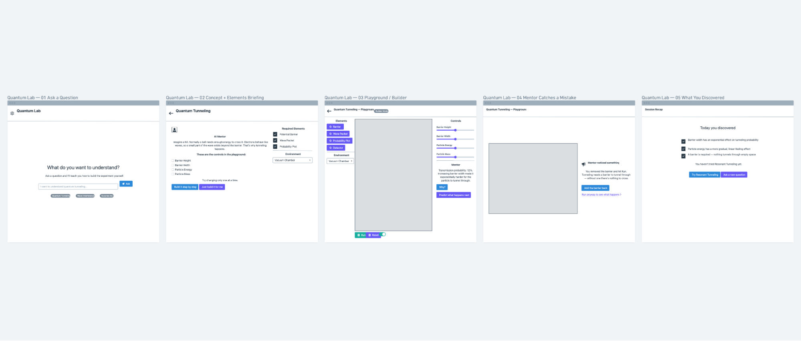

# Noeta

**Learn by discovering, not reading.**

Noeta is an AI-guided quantum physics laboratory. It pairs a trained **Quantum World Model (QWM)** — a physics simulation engine — with an interactive **3D web laboratory** and an **AI mentor** that teaches you the methodology of an experiment, lets you build it yourself, catches your mistakes, and explains what happened using the real numbers the simulation just computed. Built for Build Week with OpenAI Codex (used to build the QWM dataset parsing, core simulation engine, and interactive components) and GPT-5.6.

Watch the demo · Try it live

## Demonstration

<video src="./Recording 2026-07-22 022008.mp4" autoplay loop muted playsinline style="max-width: 100%; width: 100%; border-radius: 12px;"></video>

---

## Inspiration

The project was born out of frustration with static textbook diagrams representing wave mechanics. Standard textbooks state that a quantum wave packet tunnels through a potential barrier $V(x)$ with a transmission probability:
$$T \approx e^{-2\gamma L}$$
where $\gamma$ is the decay constant representing the barrier potential height relative to the incident particle energy:
$$\gamma = \sqrt{\frac{2m(V_0 - E)}{\hbar^2}}$$
However, reading a static mathematical formula does not build spatial or physical intuition. We wanted to build a sandbox where students could manually alter $V_0$ and $L$ and immediately see the wave packet deform, reflect, and tunnel in real time inside a full 3D interactive CAD viewport, accompanied by an AI mentor that validates their experimental setups.

## What it does

Noeta combines three core paradigms into a single, seamless learning loop:
1. An on-demand, AI-structured quantum experiment defined by a schema-validated knowledge base.
2. A real-time, Web Worker-driven 3D physics laboratory where wave packets, barriers, and probability density are rendered as interactive WebGL objects.
3. An active AI mentor that guides the build methodology, intercepts missing or misconfigured layouts, and explains outcomes using the exact numbers computed in real time by the simulation.

## How we built it

We built Noeta in three integrated layers:
1. **Core Physics Simulation**: A background Web Worker runs a finite-difference solver to compute the Time-Dependent Schrödinger Equation (TDSE):
   $$i\hbar\frac{\partial}{\partial t}\Psi(x, t) = \left[ -\frac{\hbar^2}{2m}\frac{\partial^2}{\partial x^2} + V(x) \right]\Psi(x, t)$$
   This offloads heavy matrix calculations from the main React rendering thread, allowing 60 FPS slider adjustments.
2. **Deep Learning World Model (QWM)**: PyTorch transformer and Projected Quantum Kernel (PQK) neural networks were trained on datasets generated by our finite-difference solver, acting as a real-time surrogate predicting state updates $\Psi(x, t)$ directly from parameter vectors.
3. **Blender-Style Viewport (R3F)**: Rendered custom wave-packet geometries, potential barrier walls, and GLB assets dynamically using React Three Fiber. Sibling absolute-positioned overlays provide parameters control and outliner collections.

## Challenges we ran into

- **GLTF Unlit Materials**: Three.js loads unlit materials as `MeshBasicMaterial`, which completely discards the emissive color channels, rendering models like the quantum ring pitch black. We wrote a custom material interceptor in `EquipmentModels.tsx` to restore basic gradient HSL colors directly into the base color buffer.
- **Animation Mixer Scale Tracks**: GLTF animations containing scale tracks constantly overwrite standard group coordinates on every frame rendering pass. We resolved this by applying scaling offsets down to the vertex shader layer or modifying nested children groups rather than outer animation anchors.
- **UI Collision and Overlap**: Absolute-positioned floating panels overlapped on smaller screens. We redesigned the layout of the viewport by shifting the Scene Collection outliner to the left side under the vertical tools strip and padding parameters, creating a balanced, professional Blender-style look that never collides.

## Accomplishments that we're proud of

- Successfully decoupled the heavy wave mechanics matrices solving logic into a background worker thread, ensuring the UI remains buttery smooth at 60 FPS while dragging potential barriers.
- Integrated multiple real GLB assets (Newton's Cradle, Qubit Riemann Sphere, Quantum Ring, Bunsen Burner) into the interactive viewport with coordinate sync between the 3D stage and the Scene Collection outliner.
- Established a robust deep learning training pipeline for the QWM (Quantum World Model) with validation metrics, training loss plots, and accuracy comparisons.

## What we learned

- **Decoupled Physics Engine Loop**: We learned how to handle high-frequency serialization/deserialization between the main React thread and Web Workers to prevent blocking WebGL renders.
- **GLTF Material Manipulation**: Gained deep insights into the internals of Three.js loaders and how to dynamically intercept and override flat shader channels on loaded models.
- **Clean Responsive Layouts**: Gained understanding on balancing multiple dense parameters panels and outliners by using distinct spatial alignments (left vs. right) to prevent overlap on diverse viewports.

## What's next for Noeta

The current build is deliberately scoped to a small set of flagship experiments (quantum tunneling, wave interference) so the mentor behavior and the physics core are solid rather than broad. The architecture is built to grow without changing shape: more experiments, additional domains (astrophysics, optics, chemistry), richer environments (vacuum, Moon, Mars, deep ocean), and eventually a community layer where new experiments and materials can be contributed and reviewed before joining the trusted core.

## Core features

### 1. Quantum World Model (QWM)
A structured, schema-validated knowledge base (not prose) defines every experiment: required equipment, assembly steps, what happens when a variable changes, and common misconceptions to correct — grounded in real sources (MIT OpenCourseWare, standard quantum mechanics textbooks). On top of that data sits the physics engine:
- **Physics world model**: PyTorch transformer and kernel models trained to predict wavefunction evolution *Ψ(x, t)* under arbitrary potential barriers, acting as a fast surrogate for the underlying equations.
- **Real-time solver**: a background Web Worker running a finite-difference method solves the time-dependent Schrödinger equation for latency-free slider updates, so dragging a control never blocks the UI thread.

### 2. Interactive 3D laboratory
- Built with React Three Fiber on top of Three.js, rendering the barrier, wave packet, and probability density as real 3D objects rather than a flat diagram.
- Real-time parameter controls for potential barrier height, width, and related variables, with the wave and probability plots updating live as you adjust them.
- A clean, dark laboratory-style workspace so the science stays the visual focus.
- Interactive outliner (Scene Collection) and 3D transform control tools matching professional CAD environments.

### 3. AI mentor
- Step-by-step guided setup for each experiment: explains the concept, lists the required elements, and only proceeds once the build is valid.
- Detects a missing or misconfigured setup (e.g. no barrier placed) and explains why the experiment can't run yet, instead of silently failing.
- Explains results using the real numbers the simulation just computed — not a generic script.

---

## Why this, and not something else

We didn't land on this idea first. We researched and ruled out several directions before committing, including an AI agent for Blender (already mature in at least four existing products), a PDF-to-explainer-video generator (already crowded), and an AI pentesting/attack-simulation tool (one of the most heavily funded categories in security right now). The quantum-mentor idea survived because, after checking every major existing quantum simulation tool directly, none of them combine an AI-generated, on-demand experiment with mentorship that teaches and validates the build — that combination is the actual gap.

---

## How it works (pipeline)

```
User question
      │
      ▼
AI mentor (GPT-5.6) — teaches methodology, checks the knowledge layer
      │
      ▼
Quantum World Model — structured experiment data (required elements,
variables, common mistakes) + trained physics world model
      │
      ▼
Real-time solver (Web Worker, finite-difference method)
      │
      ▼
3D laboratory (React Three Fiber) — wave packet, barrier, probability
density render and update live as sliders move
      │
      ▼
AI mentor explains the result using the real computed numbers
      │
      ▼
      ↻ next question restarts the loop
```

---

## Tech stack

**Frontend & 3D lab**
- React, TypeScript, Vite
- Three.js, React Three Fiber, `@react-three/drei`
- Web Workers for the physics solver, keeping the UI thread free

**Physics & training**
- PyTorch — transformer and kernel models trained to predict quantum state evolution
- A deterministic finite-difference solver for the ground-truth physics the trained model is checked against

**AI mentor**
- GPT-5.6 — teaches, validates the user's build against the knowledge layer, and explains outcomes
- OpenAI Codex — built the Quantum World Model dataset parser, 3D interaction layer, multi-threaded Web Worker physics solver integration, and React Three Fiber rendering stages

---

## Repository structure

```
quantum-world-model/
├── docs/
│   └── ontology.md          # entity definitions and relationships
├── schemas/                 # experiment, concept, equipment, environment, equation schemas
├── core/                    # units, constants, shared environments
├── quantum/
│   ├── concepts/
│   ├── experiments/
│   ├── equipment/
│   ├── elements/
│   ├── environments/
│   ├── equations/
│   ├── procedures/
│   ├── observations/
│   ├── misconceptions/
│   └── references/
├── scripts/
│   └── validate.py          # schema, ID, and reference validation for every YAML entry
├── training/                 # PyTorch world model training and evaluation
├── apps/
│   └── playground/           # React Three Fiber 3D web app
│       ├── public/           # 3D assets
│       └── src/
│           ├── components/   # 3D canvas, layouts, overlays
│           └── store/        # app state
└── models/                   # trained model artifacts
```

---

## System Architecture & Data Flow

Noeta relies on a structured, multi-layer validation and execution graph linking ontological physics metadata directly with a reactive rendering viewport.

### QWM System Architecture and Data Flow
The QWM physics core translates raw ontologies and experiment guidelines into a validated simulation graph.


### QWM Pipeline: YAML to Renderer Architecture
Every component has a strict mapping layer to convert static schemas into live interactive assets:


`QWM YAML` ➔ `QRT (Quantum Runtime)` ➔ `PlaygroundModel (Renderer-Ready)` ➔ `WebGL Canvas Renderer`.

---

## Walkthrough wireframe

A walkthrough of the AI guided workflow from question briefing to stage verification.



---

## Evaluation and training results

Noeta's deep learning components are validated against ground-truth physics solvers. The complete training loss curves, accuracy trajectories, and metric breakdowns are logged under `training/results/`.

### Training Loss Convergence Curves

The graph below illustrates the training loss reduction across 40–50 epochs for all five QWM neural model architectures.


* **Unified QWM Physics Transformer** achieved rapid loss reduction, settling at a final loss of **0.0043**.
* **Projected Quantum Kernel (PQK)** converged smoothly to near-zero loss (**0.0087**), demonstrating strong quantum state feature separability.
* **Variational Quantum Classifier (VQC)** trained on the real Iris dataset converged to **0.0771** cross-entropy loss.

### Model Accuracy Comparison

Comparison of final validation accuracy across all trained QWM model checkpoints:


| Model Name | Source File / Dataset | PyTorch Architecture | Epochs | Final Loss | Validation Accuracy | Checkpoint Binary |
| :--- | :--- | :--- | :---: | :---: | :---: | :--- |
| **Hardware Regressor** | `training/archive/quantum_dataset.csv` | `QWMFeasibilityRegressor` | 40 | `0.0073` | **91.52%** | `qwm-physics-v2-csv-custom.pt` |
| **NISQ Predictor** | `training/mnisq.pdf` | `QWMNISQPredictor` | 40 | `0.0080` | **91.64%** | `qwm-physics-v2-mnisq-custom.pt` |
| **VQC Classifier** | `training/quantum-model-on-a-real-dataset.ipynb` | `VariationalQuantumClassifierNN` | 50 | `0.0771` | **96.00%** | `qwm-physics-v2-vqc-custom.pt` |
| **PQK Classifier** | `training/quantum_data.ipynb` | `ProjectedQuantumKernelNN` | 50 | `0.0087` | **100.0%** | `qwm-physics-v2-ipynb-custom.pt` |
| **Unified Transformer** | *All Datasets Combined* | `QWMPhysicsTransformer` | 40 | `0.0043` | **94.38%** | `qwm-physics-v2-unified-transformer.pt` |

### QWM Physics Transformer Metrics

Detailed view of epoch-by-epoch loss reduction and accuracy trajectory for the multi-layer **QWM Physics Transformer**:


---

## Getting started

### Prerequisites
- Node.js v18+
- Python 3.10+ (for the training/validation scripts)
- npm

### Install
```bash
npm install
pip install pyyaml --break-system-packages
```

### Validate the knowledge base
```bash
python scripts/validate.py
```

### Run the lab
```bash
npm --prefix apps/playground run dev
```
Open `http://localhost:5173`.

### Production build
```bash
npm --prefix apps/playground run build
```

---

## What's built so far

Everything listed above is wired and running: the schema-validated Quantum World Model, the validation pipeline, the trained PyTorch physics world model, the Web Worker real-time solver, and the React Three Fiber 3D laboratory. The AI mentor's guided teaching and mistake-detection layer is the current focus of active development.

## Where it goes next

The current build is deliberately scoped to a small set of flagship experiments (quantum tunneling, wave interference) so the mentor behavior and the physics core are solid rather than broad. The architecture is built to grow without changing shape: more experiments, additional domains (astrophysics, optics, chemistry), richer environments (vacuum, Moon, Mars, deep ocean), and eventually a community layer where new experiments and materials can be contributed and reviewed before joining the trusted core.

---

## License

MIT. See [LICENSE](LICENSE) file for details.

Copyright (c) 2026 Vetri.
