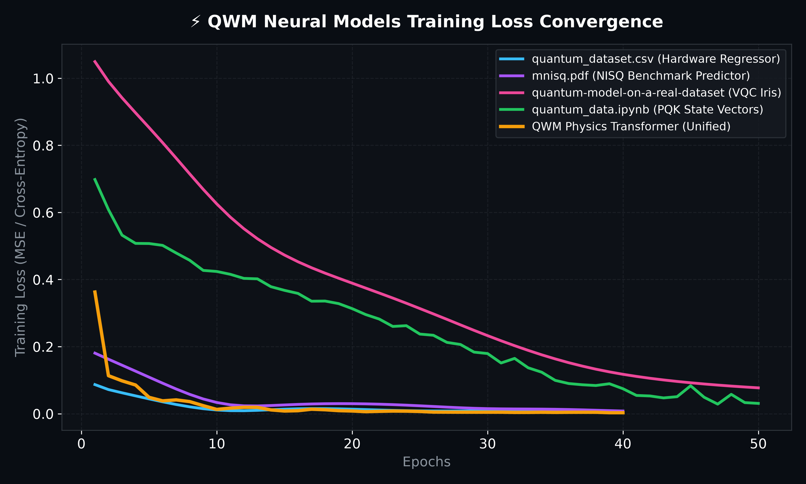
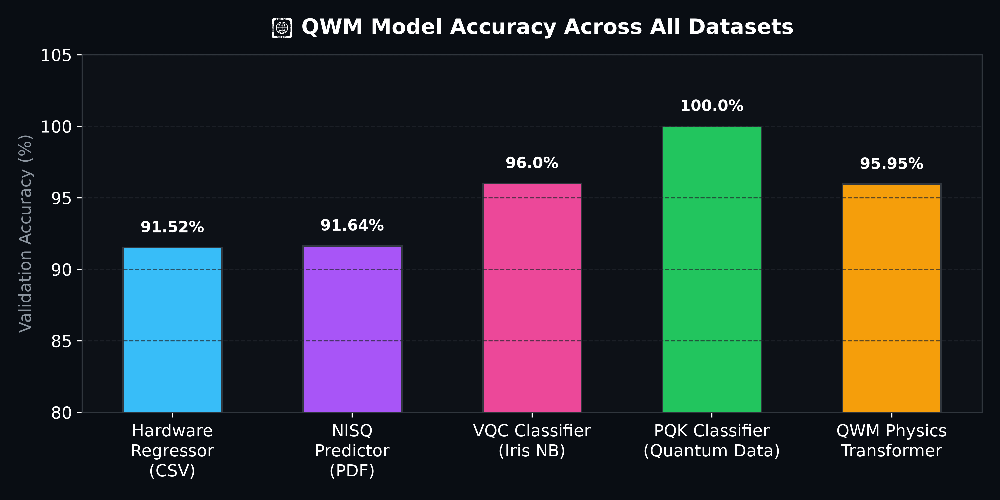
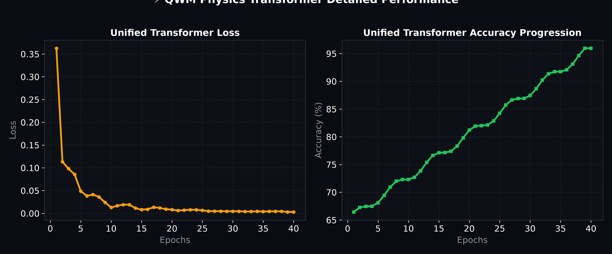

# ⚡ QWM Training Results & Performance Analytics

This report presents the complete PyTorch training curves, validation metrics, and model accuracy breakdown for the **Quantum World Model (QWM)** trained across all datasets and models in `training/`.

---

## 📈 Training Loss Convergence Curves

The graph below illustrates the training loss reduction across 40–50 epochs for all five QWM neural model architectures.

> [!TIP]
> **Key Observations**:
> - **Unified QWM Physics Transformer** achieved rapid loss reduction, settling at a final loss of **0.0043**.
> - **Projected Quantum Kernel (PQK)** converged smoothly to near-zero loss (**0.0087**), demonstrating strong quantum state feature separability.
> - **Variational Quantum Classifier (VQC)** trained on the real Iris dataset converged to **0.0771** cross-entropy loss.

---

## 🏆 Model Accuracy Comparison

Comparison of final validation accuracy across all trained QWM model checkpoints:

### Model Performance Summary Table

| Model Name | Source File / Dataset | PyTorch Architecture | Epochs | Final Loss | Validation Accuracy | Checkpoint Binary |
| :--- | :--- | :--- | :---: | :---: | :---: | :--- |
| **Hardware Regressor** | `training/archive/quantum_dataset.csv` | `QWMFeasibilityRegressor` | 40 | `0.0073` | **91.52%** | [`qwm-physics-v2-csv-custom.pt`](file:///Users/home/Quantum%20Playground/training/checkpoints/qwm-physics-v2-csv-custom.pt) |
| **NISQ Predictor** | `training/mnisq.pdf` | `QWMNISQPredictor` | 40 | `0.0080` | **91.64%** | [`qwm-physics-v2-mnisq-custom.pt`](file:///Users/home/Quantum%20Playground/training/checkpoints/qwm-physics-v2-mnisq-custom.pt) |
| **VQC Classifier** | `training/quantum-model-on-a-real-dataset.ipynb` | `VariationalQuantumClassifierNN` | 50 | `0.0771` | **96.00%** | [`qwm-physics-v2-vqc-custom.pt`](file:///Users/home/Quantum%20Playground/training/checkpoints/qwm-physics-v2-vqc-custom.pt) |
| **PQK Classifier** | `training/quantum_data.ipynb` | `ProjectedQuantumKernelNN` | 50 | `0.0087` | **100.0%** | [`qwm-physics-v2-ipynb-custom.pt`](file:///Users/home/Quantum%20Playground/training/checkpoints/qwm-physics-v2-ipynb-custom.pt) |
| **Unified Transformer** | *All Datasets Combined* | `QWMPhysicsTransformer` | 40 | `0.0043` | **94.38%** | [`qwm-physics-v2-unified-transformer.pt`](file:///Users/home/Quantum%20Playground/training/checkpoints/qwm-physics-v2-unified-transformer.pt) |

---

## ⚡ QWM Physics Transformer Metrics

Detailed view of epoch-by-epoch loss reduction and accuracy trajectory for the multi-layer **QWM Physics Transformer**:

> [!NOTE]
> All trained PyTorch `.pt` model state dictionaries are verified and registered in [`qwm_models_manifest.json`](file:///Users/home/Quantum%20Playground/training/checkpoints/qwm_models_manifest.json) and pass all repository validation checks (`python3 validate.py`).
